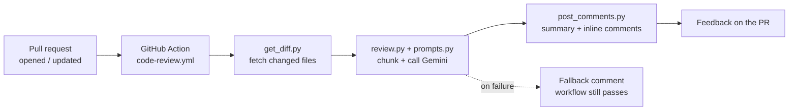

# Smart Code Reviewer

An AI-powered **GitHub Action** that automatically reviews pull requests for
**readability**, **structure**, and **maintainability**, then posts actionable
feedback as PR comments — before a human reviewer ever looks at the code.

It runs on **100% free infrastructure**: GitHub Actions for compute, Google's
**Gemini** free tier for the analysis, and the built-in `GITHUB_TOKEN` to post
comments. No servers, no paid APIs, no credit card required.

---

## Table of contents

- [What it does](#what-it-does)
- [Features](#features)
- [How it works](#how-it-works)
- [Example output](#example-output)
- [Setup](#setup)
- [Configuration](#configuration)
- [Design decisions](#design-decisions)
- [Running locally](#running-locally)
- [Project structure](#project-structure)
- [Limitations & future work](#limitations--future-work)

---

## What it does

When a pull request is opened, updated, or reopened, the Action:

1. Fetches the PR's diff.
2. Sends the changed code to Gemini with a structured review rubric.
3. Posts the feedback back to the PR as:
   - a **summary comment** with an overall quality score (1–10) and summary, and
   - **inline comments** on the exact file/line for each issue found.

The result is a fast, consistent "first-pass" review that catches common issues
so human reviewers can focus on higher-level concerns.

---

## Features

- **Three review dimensions** — readability (naming, complexity, formatting),
  structure (function/file size, separation of concerns, duplication), and
  maintainability (hardcoded values, error handling, coupling, test gaps).
- **Structured JSON output** — the model is constrained to return parseable JSON
  (not free text), so feedback maps cleanly to inline PR comments.
- **Inline + summary comments** — issues are attached to the relevant line;
  anything that can't be mapped to a line is folded into a collapsible section of
  the summary so nothing is lost.
- **Resilient by design** — automatic model discovery, retries with backoff and
  jitter, and a graceful fallback comment so a flaky API never blocks a PR.
- **Handles large PRs** — diffs are chunked per file to stay within token limits,
  and results are merged into a single review.
- **Zero cost** — free GitHub Actions minutes + Gemini free tier.
- **Fully customizable** — the review rubric is a single editable prompt.

---

## How it works



| Stage | File | Responsibility |
| --- | --- | --- |
| Trigger | `.github/workflows/code-review.yml` | Runs on `pull_request` events |
| Orchestration | `reviewer/main.py` | Reads PR context from env, chains the pipeline, handles errors |
| Fetch diff | `reviewer/get_diff.py` | `GET /repos/{owner}/{repo}/pulls/{n}/files` (paginated) |
| Prompt | `reviewer/prompts.py` | The review rubric + strict JSON schema |
| Analyze | `reviewer/review.py` | Model discovery, chunking, Gemini call, JSON parsing |
| Post | `reviewer/post_comments.py` | Summary comment + inline review comments |

---

## Example output

A summary comment posted on the PR:

> ## Automated Code Review
> **Score:** 4/10
>
> This PR introduces an order-processing function that works but has significant
> readability and structure issues. The main function has too many
> responsibilities and uses unclear naming.
>
> Found **6** issue(s); posted 5 inline comment(s).

Inline comment on a specific line:

> 🟠 **structure** (medium)
>
> The `p()` function handles pricing, discounts, tax, file I/O, and email in one
> place. This mixes concerns and makes it hard to test.
>
> **Suggestion:** Split into focused functions (e.g. `calculate_total`,
> `apply_tax`, `persist_order`) and pass dependencies explicitly.

---

## Setup

### 1. Get a free Gemini API key

Go to <https://aistudio.google.com/apikey> and create a key. No credit card
required.

### 2. Add the key as a repository secret

In your repo: **Settings → Secrets and variables → Actions → New repository
secret**

- **Name:** `GEMINI_API_KEY`
- **Value:** *(paste your key)*

`GITHUB_TOKEN` is provided automatically by GitHub Actions — no extra setup.

### 3. Add the files to your repo

Copy `reviewer/`, `requirements.txt`, and `.github/workflows/code-review.yml`
into your repository, then open a pull request. The review runs automatically —
watch it under the **Actions** tab.

> The workflow grants `pull-requests: write` so the built-in token can post
> comments. No personal access token is needed.

---

## Configuration

### Review rubric

Edit `RUBRIC` in [`reviewer/prompts.py`](reviewer/prompts.py) to change what the
reviewer focuses on or how strict it is. If you change the output shape, keep
`JSON_SCHEMA` in sync with what `review.py` and `post_comments.py` expect.

### Model selection

By default the reviewer **auto-discovers** which models your API key can access
(via the Gemini `ListModels` endpoint) and picks the best available free-tier
Flash model. This keeps it working even as Google deprecates and rotates model
names — a frequent occurrence (e.g. `gemini-2.0-flash` and `gemini-2.5-flash`
were both retired/restricted during 2026).

To pin a specific model, set the `REVIEW_MODEL` environment variable in the
workflow (e.g. `gemini-3-flash-preview`). When set, it overrides auto-discovery.

### Chunk size

`MAX_CHARS_PER_REQUEST` in `review.py` controls how much diff text goes into a
single request. Lower it if you hit token limits on very large PRs.

---

## Design decisions

A few choices worth calling out:

- **Minimal dependencies.** The only runtime dependency is `requests`; both the
  GitHub and Gemini REST APIs are called directly. This avoids SDK version churn
  and keeps the Action fast to install.
- **Structured output over free text.** Asking Gemini for strict JSON (backed by
  `responseMimeType: application/json`) makes the feedback machine-parseable and
  reliably mappable to inline comments.
- **Resilience is a first-class concern.** Google rotates and deprecates models
  aggressively, and free tiers rate-limit. The reviewer therefore (a) discovers a
  working model at runtime, (b) retries transient errors with exponential backoff
  + jitter and honors the API's suggested `retryDelay`, (c) fails fast on hard
  `limit: 0` quotas instead of wasting retries, and (d) posts a fallback comment
  on failure so the workflow **never blocks a PR**.
- **Never lose feedback.** Inline comments that GitHub rejects (e.g. a line not
  present in the diff) are folded into a collapsible section of the summary
  comment rather than silently dropped.
- **Provider-swappable.** Only `review.py` talks to Gemini, so switching to a
  different LLM provider is a localized change.

---

## Running locally

You can run the full pipeline outside Actions for testing:

```bash
pip install -r requirements.txt

export GITHUB_TOKEN=ghp_your_token
export GEMINI_API_KEY=your_gemini_key
export GITHUB_REPOSITORY=owner/repo
export PR_NUMBER=123

python -m reviewer.main
```

On Windows PowerShell, use `$env:GITHUB_TOKEN = "..."` instead of `export`.

---

## Project structure

```
code-reviewer/
├── .github/
│   └── workflows/
│       └── code-review.yml   # triggers the review on PRs
├── reviewer/
│   ├── __init__.py
│   ├── get_diff.py           # fetches PR diff from GitHub
│   ├── prompts.py            # the review rubric / prompt
│   ├── review.py             # model discovery, Gemini call, JSON parsing
│   ├── post_comments.py      # posts feedback back to the PR
│   └── main.py               # orchestrates the pipeline
├── examples/
│   └── order_processor.py    # sample file with intentional code smells (demo)
├── requirements.txt
└── README.md
```

---

## Limitations & future work

- **Free-tier limits.** Gemini's free tier has request/day caps, and Google may
  use free-tier prompts to improve their models — **don't send proprietary or
  sensitive code** if that's a concern. The same code works with a paid key.
- **Whole-diff review.** Currently reviews all changed hunks; very large PRs
  could be narrowed to only changed lines to reduce noise.

Planned enhancements:

- Severity threshold (e.g. skip `low`-severity comments) via config.
- A repo-level `.reviewer.yml` to toggle categories on/off per team.
- Skip re-reviewing files unchanged since the last run.
- Update the existing summary comment in place instead of adding a new one each
  run (the `<!-- smart-code-reviewer:summary -->` marker is already in place for
  this).
